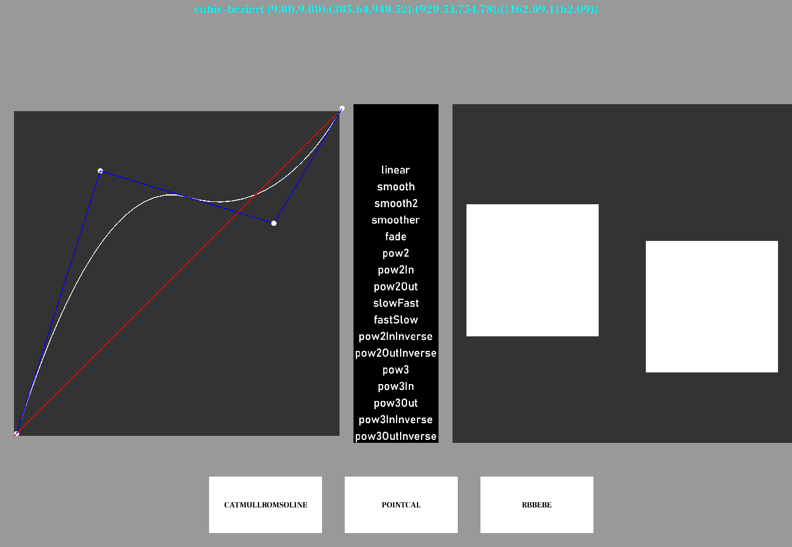
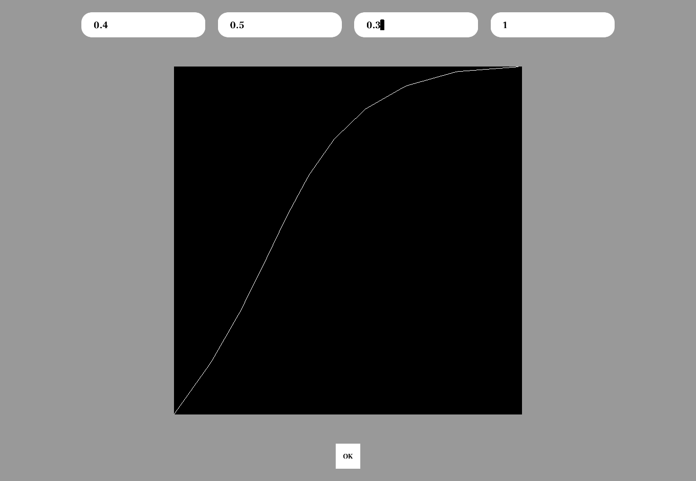
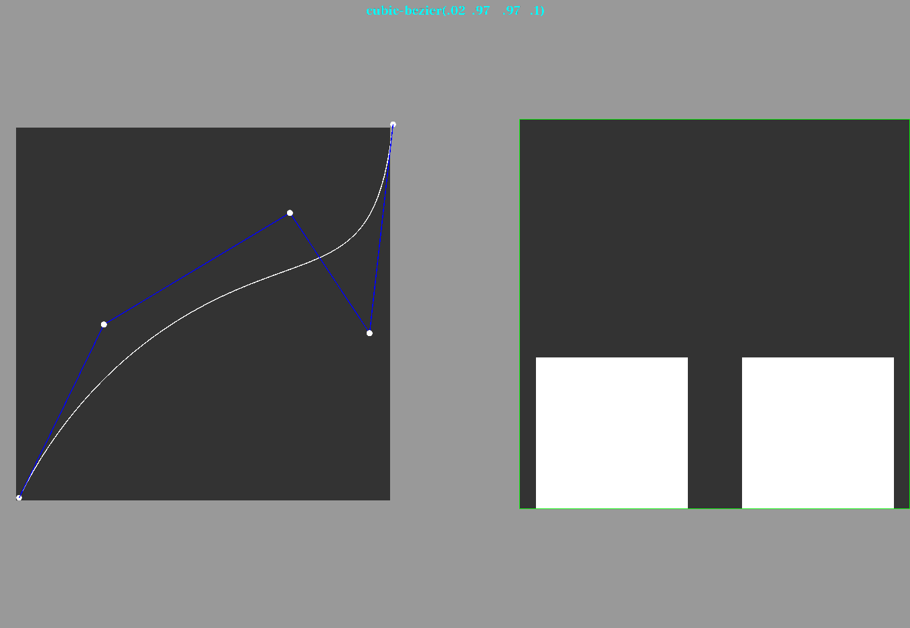

# 贝塞尔曲线

## 可视工具

- 主界面 


- 三种方式



- 3.x版本的spine曲线



- 可以写运动轨迹



## 使用

Actions动画  求百分比

执行apply方法

```java
public float apply (float a) {
    if (a <= 0.5f) return (float)Math.pow(a * 2, power) / 2;
    return (float)Math.pow((a - 1) * 2, power) / (power % 2 == 0 ? -2 : 2) + 1;
}

```
直接计算结果，百分比来取数值，  

计算数值

```java
public void jisuan(Array<Vector2> controlPoint){
    int n = controlPoint.size - 1; //
    int i, r;
    float u;
    // u的步长决定了曲线点的精度
    for (u = 0; u <= 1; u += 0.01) {
        Vector2 p[] = new Vector2[n + 1];
        for (i = 0; i <= n; i++) {
            p[i] = new Vector2(controlPoint.get(i));
        }
        for (r = 1; r <= n; r++) {
            for (i = 0; i <= n - r; i++) {
                p[i].x = (1 - u) * p[i].x + u * p[i + 1].x;
                p[i].y = (1 - u) * p[i].y + u * p[i + 1].y;
            }
        }
        array1.add(p[0]);
    }
}
```

复写apply

```java
public float apply (float a) {
    var num = array1.get((array1.size-1) * a);
    value = num / height ;
}
```

## 自定义动画

### 使用

```java
image1.addAction(Actions.scaleTo(3,3,3, new Bse(array1)));
```

### 复写方法

```java
public class Bse extends Interpolation{
    private Array<Vector2> array;
    public Bse (Array<Vector2> array) {
        this.array = array;
    }

    public float apply (float a) {
        //我们使用下标取值  所以转换为int
        int v = (int)(a * 100.0F);
        //工具的高为720，所以这里除以720
        return array.get(v).y/720;
    }
}
```

将每一个点的坐标都记录下来，然后根据百分比再这个区域中取值。


## 使用spine计算动画

```java
public class BseInterpolation extends Interpolation {
    private float[] curves = new float[18];

    @Override
    public float apply(float a) {
        return getCurvePercent(a);
    }

    public void setCurve (float cx1, float cy1, float cx2, float cy2) {
        float tmpx = (-cx1 * 2 + cx2) * 0.03f, tmpy = (-cy1 * 2 + cy2) * 0.03f;
        float dddfx = ((cx1 - cx2) * 3 + 1) * 0.006f, dddfy = ((cy1 - cy2) * 3 + 1) * 0.006f;
        float ddfx = tmpx * 2 + dddfx, ddfy = tmpy * 2 + dddfy;
        float dfx = cx1 * 0.3f + tmpx + dddfx * 0.16666667f, dfy = cy1 * 0.3f + tmpy + dddfy * 0.16666667f;
        float x = dfx;
        float y = dfy;

        float curves[] = this.curves;
        int i = 0;
        for (int n = i + 19 - 1; i < n; i += 2) {
            curves[i] = x;
            curves[i + 1] = y;
            dfx += ddfx;
            dfy += ddfy;
            ddfx += dddfx;
            ddfy += dddfy;
            x += dfx;
            y += dfy;
        }
    }


//
//
    public float getCurvePercent (float percent) {
        percent = MathUtils.clamp(percent, 0, 1);
        float[] curves = this.curves;
        int i = 0;
        float x = 0;
        for (int start = i, n = i + 19 - 1; i < n; i += 2) {
            x = curves[i];
            if (x >= percent) {
                if (i == start) return curves[i + 1] * percent / x; // First point is 0,0.
                float prevX = curves[i - 2], prevY = curves[i - 1];
                return prevY + (curves[i + 1] - prevY) * (percent - prevX) / (x - prevX);
            }
        }
        float y = curves[i - 1];
        float v = y + (1 - y) * (percent - x) / (1 - x);
        System.out.println(v);
        return v;
    }
}

```


set方法是传递进去的参数，spine动画json文件中的，让每次调用一次apply得到一个百分比，然后通过百分比来得到数组中的值。
这种方式每次记录点的个数是19，和第一种的实现方式相同，为什么是19个点，我也不知道，应该是对于的点，没必要把。


## 画曲线的新方法


